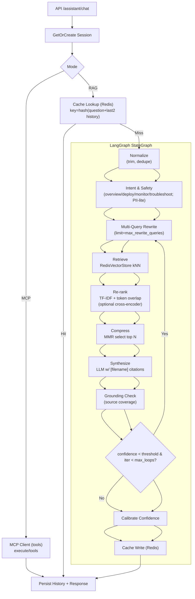
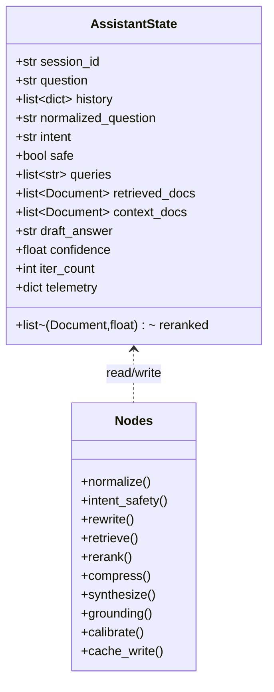
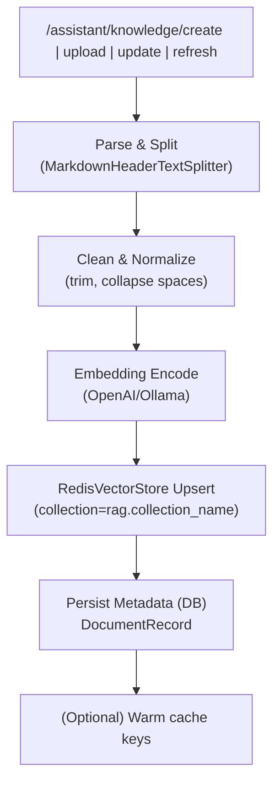

# 智能小助手使用指南

## 智能小助手（Assistant）架构总览



## LangGraph 状态与节点



## 知识入库流水线



## 关键组件与实现

- **LLM与Embedding**: `config.llm.provider` 选择 `openai` 或 `ollama`。推理使用 `ChatOpenAI/ChatOllama`；向量使用 `OpenAIEmbeddings/OllamaEmbeddings`（模型取自 `config.llm.embedding_model`）。
- **向量存储**: 自研 `RedisVectorStore`，向量与元数据落在 Redis；内存缓存加速索引与向量读取；检索支持 `similarity_search` 与可选 `keyword_search`（当 `rag.retrieve.hybrid_enabled=true` 时补充召回）。
- **会话管理**: 进程内 `SessionManager`，保存最近 20 条消息并生成简要 `context_summary`；`/assistant/session/create` 返回 `session_id`。
- **缓存**: `RedisCacheManager`，key=hash(question+最近2条history)，TTL 默认 3600s，支持压缩与LRU清理；命中直接返回并记录统计。
- **改写与并发检索**: `rewrite` 生成多变体查询，最多 `rag.max_rewrite_queries` 条；`retrieve` 对这些查询并发检索并去重合并。
- **重排与压缩**: 默认 TF-IDF + 关键词重叠打分；`compression` 使用 MMR 选择 `rag.compression.mmr_top_k` 篇上下文。
- **生成与归因**: 生成严格限制长度（`rag.answer.max_chars`），引用 `[filename]`；`grounding` 统计覆盖率。
- **置信度校准与迭代**: `calibrate` 融合召回分、长度、覆盖率给出 `confidence`；若低于 `rag.iteration.retry_confidence_threshold` 且 `iter_count < rag.iteration.max_loops`，回到 `rewrite` 进行一次自我迭代。
- **空召回回退**: 无文档时走最佳实践模板，返回可执行排障步骤（K8s 场景优化）。

## API 一览

- **聊天**: POST `/assistant/chat`
  - 请求: `{ "session_id": "...", "query": "...", "mode": 1|2 }`（1=RAG，2=MCP）
  - 响应: `{ "response": str, "confidence": float }`
- **会话**: POST `/assistant/session/create`
- **历史记录**: GET `/assistant/history/list` | GET `/assistant/history/detail/{id}` | DELETE `/assistant/history/delete/{id}`
- **知识库**:
  - 列表/详情: GET `/assistant/knowledge/list` | GET `/assistant/knowledge/detail/{id}`
  - 创建/更新/删除: POST `/assistant/knowledge/create` | PUT `/assistant/knowledge/update/{id}` | DELETE `/assistant/knowledge/delete/{id}`
  - 上传/下载: POST `/assistant/knowledge/upload` | GET `/assistant/knowledge/download`
  - 刷新向量库: POST `/assistant/knowledge/refresh`
- **缓存**: POST `/assistant/cache/clear`
- **健康检查**: GET `/assistant/health`
- **强制重建实例**: POST `/assistant/reinitialize`

## 配置项（与流程联动）

```yaml
llm:
  provider: openai            # openai 或 ollama
  model: Qwen/Qwen3-14B
  ollama_model: qwen2.5:3b
  base_url: https://api.siliconflow.cn/v1
  ollama_base_url: http://127.0.0.1:11434/v1

rag:
  vector_db_path: data/vector_db
  collection_name: aiops-assistant
  knowledge_base_path: data/knowledge_base
  openai_embedding_model: Pro/BAAI/bge-m3
  ollama_embedding_model: nomic-embed-text
  max_rewrite_queries: 6      # 并发检索的最大改写数

  retrieve:
    k: 12
    score_threshold: 0.0
    hybrid_enabled: false
  reranker:
    enabled: false
    model: bge-reranker-base
    top_k: 20
  iteration:
    max_loops: 1
    retry_confidence_threshold: 0.6
  compression:
    mmr_top_k: 6
    mmr_lambda: 0.7
  answer:
    max_chars: 300
    source_limit: 4

redis:
  host: 127.0.0.1
  port: 6379
  db: 0
```

提示: 缓存使用独立的 Redis DB（默认 `redis.db + 1`），前缀 `aiops_assistant_cache:`，默认 TTL 3600 秒。

### 初始化与运行

- 首次启动：读取 `rag.knowledge_base_path` 下的 `.md/.markdown/.txt`，按 Markdown 头分段并清洗后入库；向量库为空时仍可通过空召回回退提供建议。
- 运行时切换 RAG/MCP：`/assistant/chat` 通过 `mode` 切换；RAG 路径走 LangGraph，MCP 路径调用 `app.mcp.mcp_client`。
- 变更知识：上传或直接创建后，可调用 `/assistant/knowledge/refresh` 异步重建向量；或用 `/assistant/reinitialize` 重新初始化实例。

### 返回数据示例（/assistant/chat, RAG）

```json
{
  "response": "...",
  "confidence": 0.83
}
```

### 性能与调优要点

- **并发检索**: 将 `rag.max_rewrite_queries` 控制在 4–8；超大值会增加向量检索开销。
- **生成长度**: 内置最大输出 token 做了上限保护（≤800），减少延迟与费用。
- **Hybrid 检索**: 对术语不规范/短问句可开启 `rag.retrieve.hybrid_enabled=true` 提升覆盖。
- **缓存命中**: 提问相同或上下文相近（最近2条）时可直接命中缓存，显著降低时延。
