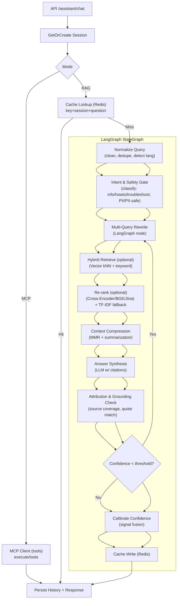
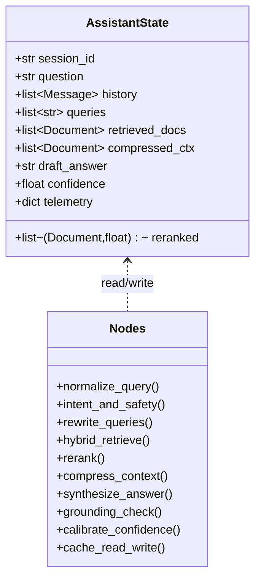
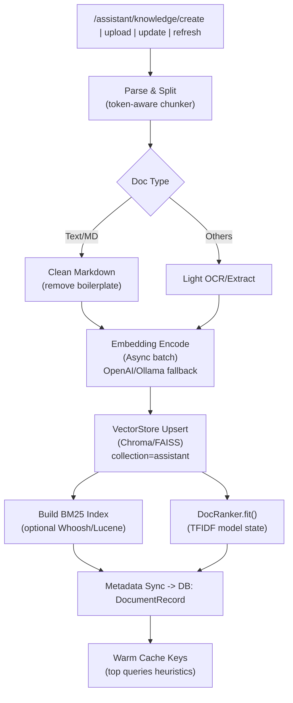

### 流程图


### 知识入库流水线



### LangGraph 全局状态


### 配置项（与流程联动）

```yaml
rag:
  retrieve:
    k: 12                    # 检索候选数量（默认12）
    score_threshold: 0.0     # 相似阈值（默认0.0）
    hybrid_enabled: false    # 可选：向量+关键词混合
  reranker:
    enabled: false           # 可选：交叉重排模型
    model: bge-reranker-base
    top_k: 20
  iteration:
    max_loops: 1             # 自我迭代最多轮次
    retry_confidence_threshold: 0.6
  compression:
    mmr_top_k: 6             # 上下文去冗文档数
    mmr_lambda: 0.7
  answer:
    max_chars: 300           # 生成答案最大字数
    source_limit: 4          # 返回来源上限
```

说明：默认仅启用向量检索 + TF-IDF 排序的精简稳定路径；Hybrid 与 Re-rank 为可选增强，开启后对 RAG 召回与排序进行进一步优化。

### 关键设计与实现要点

- 核心节点
  - normalize_query: 清洗、归一化、语言检测、去重。
  - intent_and_safety: 问题意图分类（info/howto/troubleshoot/overview），轻量安全检验（避免注入、PII）。
  - rewrite_queries: 多变体改写（同义词/术语拼接/关键词组合），保留 ≤ 12 个候选。
  - hybrid_retrieve: 向量检索 + 关键词/BM25 混合召回，扩大覆盖面。
  - rerank: 交叉重排（可选 bge-reranker/jina-reranker）结合 TF-IDF 排序器，融合分数。
  - compress_context: MMR 去冗 + 结构化摘要，限制上下文长度。
  - synthesize_answer: 带来源引用的生成，平台类问题追加平台聚焦提示。
  - grounding_check: 引用定位与覆盖率检查，必要时回退到 rewrite 节点循环一次。
  - calibrate_confidence: 基于召回质量、重排分、覆盖率、答案长度等打分。
  - cache_read_write: Redis 按 session+question+history 哈希缓存。

- RAG 提质策略
  - 多路召回（向量+BM25+关键词）、交叉重排、引用覆盖校验、置信度校准、低置信度自我迭代一跳。
  - 平台概览/架构类问题的专门 prompt 附加，确保平台内容优先。
  - 无召回时的最佳实践回退（保留你现有的优势，但作为 LangGraph 的降级分支）。