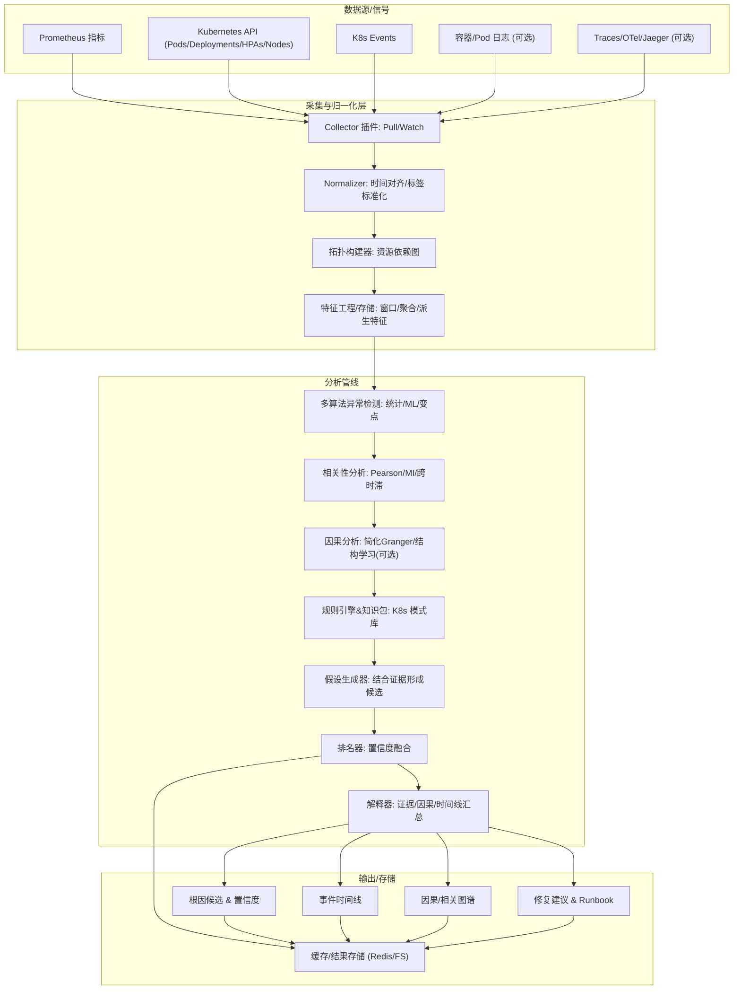

# RCA 设计概览



### 端点与 flags 返回（统一响应 APIResponse）

- GET `/api/v1/rca/metrics`（等价于 `/api/v1/metrics/list`）
  - data.flags: 平台状态
    - request_override: 是否启用“请求级开关优先”
    - logs_enabled: 全局日志采集是否开启
    - tracing_enabled: 全局Tracing采集是否开启

  示例：
  ```json
  {
    "code": 0,
    "message": "ok",
    "data": {
      "default_metrics": ["..."],
      "available_metrics": ["..."],
      "flags": {
        "request_override": true,
        "logs_enabled": true,
        "tracing_enabled": true
      }
    }
  }
  ```

- GET `/api/v1/rca/health`
  - data.flags: 同上

- GET `/api/v1/rca/topology`（等价于 `/api/v1/topology/list`）
  - data.flags: 同上

- POST `/api/v1/rca/jobs`（等价于 `/api/v1/jobs/create`）
  - data.flags: 同上（便于前端在任务提交后立即获知平台状态）

- GET `/api/v1/rca/jobs/{job_id}`
  - data.flags: 同上（任务查询时也携带平台状态）

## 日志与Tracing接入说明

- 日志采集（容器/Pod）
  - 配置开关：`logs.enabled`
  - 采样参数：`logs.tail_lines`、`logs.max_pods`、`logs.include_previous`
  - 请求级开关：`include_logs: true/false`
  - 返回：`data.logs` 列表，包含 `pod`、`namespace`、`container`、`logs`、`previous_logs`

- Trace/OTel/Jaeger 采集
  - 配置开关：`tracing.enabled`
  - 连接参数：`tracing.jaeger_query_url`、`tracing.timeout`、`tracing.max_traces`
  - 过滤参数：`tracing.service_name`（可选，亦可通过请求体 `service_name` 指定）
  - 请求级开关：`include_traces: true/false`
  - 返回：`data.traces` 列表，包含 `trace_id`、`operations`、`span_count`、`start_us`、`duration_us`

### API 使用示例

POST `/api/v1/rca`

```json
{
  "start_time": "2025-01-01T00:00:00Z",
  "end_time": "2025-01-01T01:00:00Z",
  "metrics": ["container_cpu_usage_seconds_total"],
  "include_logs": true,
  "include_traces": true,
  "namespace": "default",
  "service_name": "my-service"
}
```

### 开关优先级

- `rca.request_override: true` 时，请求体中的 `include_logs`/`include_traces` 为优先（但仍需对应全局功能 `logs.enabled`/`tracing.enabled` 已开启）。
- `rca.request_override: false` 时，以全局配置为准；请求体仅在为空时跟随全局，为 `true` 也不会强制启用关闭的全局功能。

### 返回字段补充

- `logs_enabled_effective`: 本次分析是否实际采集了容器日志（布尔）。
- `traces_enabled_effective`: 本次分析是否实际采集了 Traces/Jaeger（布尔）。
- `namespace_effective`: 本次分析实际使用的命名空间。
- `service_name_effective`: 本次分析实际使用的 Trace 服务名过滤（可能为空）。

### 配置片段

```yaml
logs:
  enabled: true
  tail_lines: 200
  max_pods: 5
  include_previous: false

tracing:
  enabled: true
  provider: jaeger
  jaeger_query_url: http://jaeger-query:16686
  timeout: 15
  service_name: ""
  max_traces: 30
```
