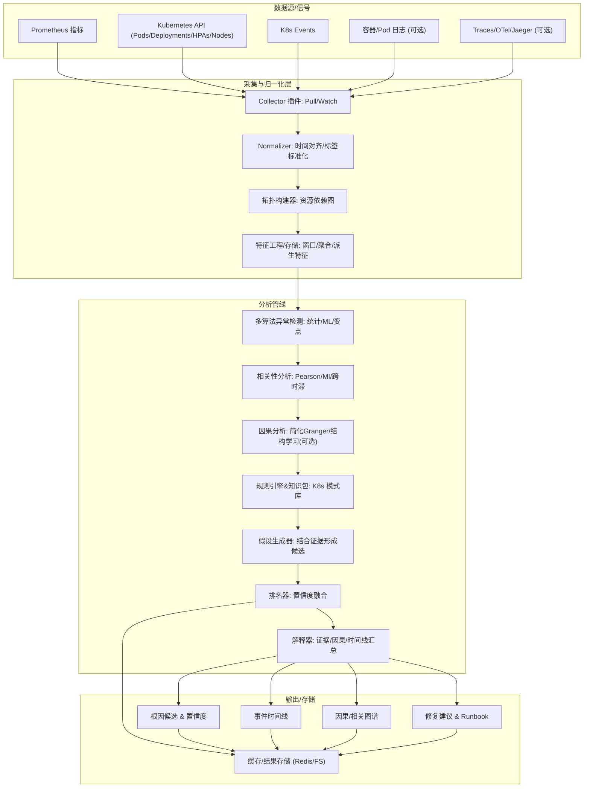

# RCA 设计概览

```mermaid
graph TD
  subgraph "数据源/信号"
    P["Prometheus 指标"]
    K["Kubernetes API (Pods/Deployments/HPAs/Nodes)"]
    E["K8s Events"]
    L["容器/Pod 日志 (可选)"]
    T["Traces/OTel/Jaeger (可选)"]
  end

  subgraph "采集与归一化层"
    C["Collector 插件: Pull/Watch"]
    N["Normalizer: 时间对齐/标签标准化"]
    G["拓扑构建器: 资源依赖图"]
    F["特征工程/存储: 窗口/聚合/派生特征"]
  end

  subgraph "分析管线"
    D["多算法异常检测: 统计/ML/变点"]
    R["相关性分析: Pearson/MI/跨时滞"]
    CA["因果分析: 简化Granger/结构学习(可选)"]
    RE["规则引擎&知识包: K8s 模式库"]
    H["假设生成器: 结合证据形成候选"]
    S["排名器: 置信度融合"]
    EX["解释器: 证据/因果/时间线汇总"]
  end

  subgraph "输出/存储"
    O1["根因候选 & 置信度"]
    O2["事件时间线"]
    O3["因果/相关图谱"]
    O4["修复建议 & Runbook"]
    M["缓存/结果存储 (Redis/FS)"]
  end

  P --> C
  K --> C
  E --> C
  L --> C
  T --> C

  C --> N --> G --> F --> D --> R --> CA --> RE --> H --> S --> EX
  EX --> O1
  EX --> O2
  EX --> O3
  EX --> O4
  S --> M
  O1 --> M
  O2 --> M
  O3 --> M
  O4 --> M
```
