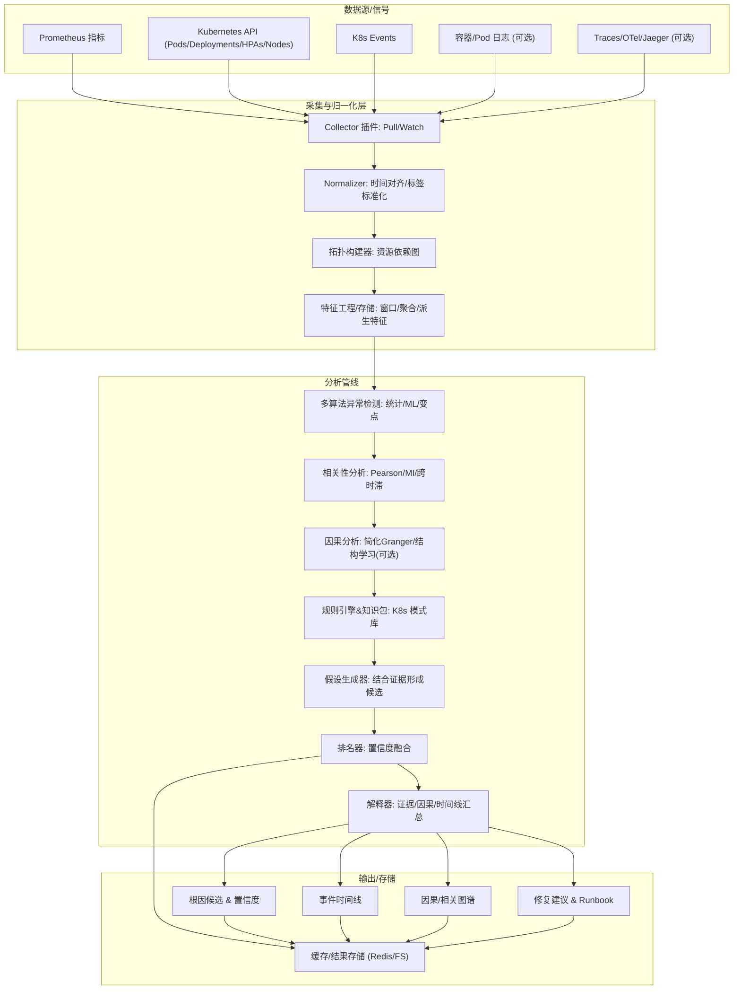

# RCA 设计概览



## 异步 RCA 任务设计

- 任务入口：`POST /api/v1/rca/jobs`
  - 请求体：`start_time`、`end_time`、`metrics`(可选)、`namespace`(可选)
  - 返回：`{ "job_id": "<id>" }`
- 任务查询：`GET /api/v1/rca/jobs/{job_id}`
  - 返回：`status`(queued/running/succeeded/failed)、`progress`、`result`/`error`
- 存储：Redis（键 `aiops:rca:job:{id}`），TTL 默认 24h
- 执行：线程池 + `asyncio.run(analyze(...))`，避免HTTP请求阻塞

## 分析输出（字段说明）

- `status`: 固定 `success` 或错误时提供 `error`
- `anomalies`: 指标异常汇总（数量、首末时间、分数、方法覆盖）
- `correlations`: 指标间显著相关性（后续拓展互信息/跨时滞）
- `root_cause_candidates`: 根因候选（包含 `metric/confidence/description`）
- `analysis_time`、`time_range`、`statistics`
- 新增上下文字段（已实现最小闭环）：
  - `events`: K8s 事件（精简字段）
  - `state`: 命名空间状态计数（pods/deployments/services）
  - `topology`: 基于状态构建的轻量拓扑（Service→Pod，占位）
  - `evidence`: 规则命中证据（占位返回空）
  - `timeline`: 事件时间线（起止 + 事件）
  - `impact_scope`: 影响范围（占位）
  - `suggestions`: 基于根因的简要建议

## 同步与兼容端点

- `POST /api/v1/rca`：同步RCA（小窗场景仍可用）
- 兼容别名：
  - `POST /api/v1/rca/anomalies` → 异常检测
  - `POST /api/v1/rca/correlations` → 相关性分析
- 实用查询：
  - `GET /api/v1/rca/metrics`：默认与可用指标
  - `GET /api/v1/rca/topology`：拓扑快照

## 调用示例（curl）

提交异步任务：

```bash
curl -sS -X POST "http://localhost:8080/api/v1/rca/jobs" \
  -H "Content-Type: application/json" \
  -d '{
    "start_time": "2025-08-08T06:00:00Z",
    "end_time": "2025-08-08T07:00:00Z",
    "metrics": [
      "container_cpu_usage_seconds_total",
      "container_memory_working_set_bytes"
    ],
    "namespace": "default"
  }'
```

查询任务：

```bash
curl -sS "http://localhost:8080/api/v1/rca/jobs/<job_id>"
```

获取拓扑：

```bash
curl -sS "http://localhost:8080/api/v1/rca/topology?namespace=default"

# 计算影响范围（从某节点出发，最多2跳，向下游）
curl -sS "http://localhost:8080/api/v1/rca/topology?namespace=default&source=svc:default/my-service&max_hops=2&direction=out"
```

跨时滞相关：

```bash
curl -sS -X POST "http://localhost:8080/api/v1/rca/cross-correlation" \
  -H "Content-Type: application/json" \
  -d '{
    "start_time": "2025-08-08T06:00:00Z",
    "end_time": "2025-08-08T07:00:00Z",
    "metrics": [
      "container_cpu_usage_seconds_total",
      "container_memory_working_set_bytes"
    ],
    "max_lags": 5
  }'
```

## 渐进增强路线

1. 事件与规则增强：按 K8s 常见模式输出可操作证据
1. 相关性升级：跨时滞 + 互信息 + 自适阈值
1. 因果探索：优先拓扑邻接对象的简化 Granger 检验
1. 拓扑影响分析：基于 Service/Endpoints 定位受影响上下游
1. 解释器：统一格式化证据/时间线/影响范围到可读报告
